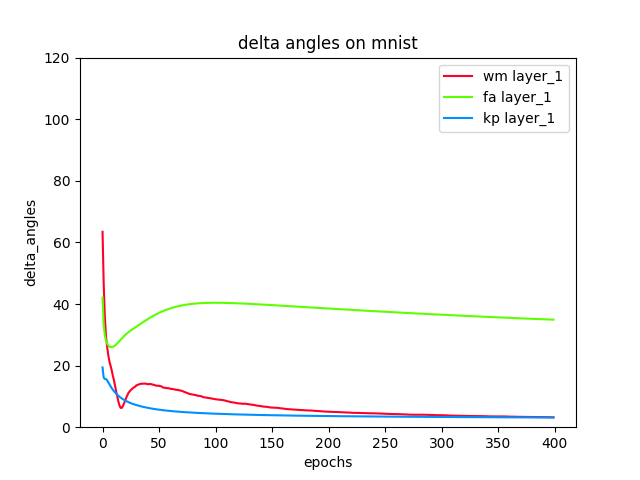
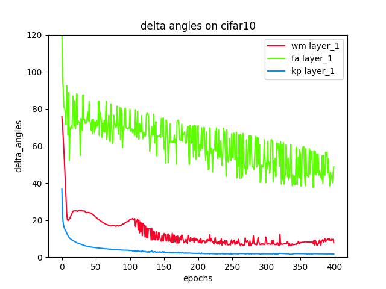
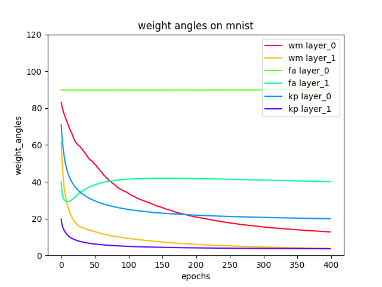
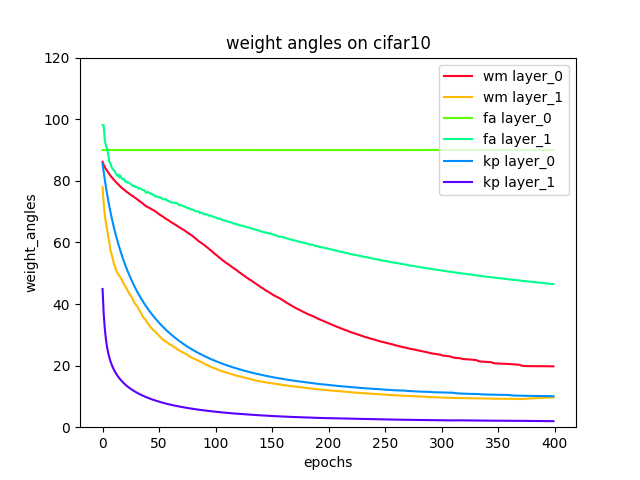

# Deep-Learning-without-Weight-Transport
##### Mohamed Akrout, Collin Wilson, Peter C. Humphreys, Timothy Lillicrap, Douglas Tweed

Current algorithms for deep learning probably cannot run in the brain because they rely on weight transport, where forward-path neurons transmit their synaptic weights to a feedback path, in a way that is likely impossible biologically. In this work, we present two new mechanisms which let the feedback path learn appropriate synaptic weights quickly and accurately even in large networks, without weight transport or complex wiring. One mechanism is a neural circuit called a weight mirror, which learns without sensory input, and so could tune feedback paths in the pauses between physical trials of a task, or even in sleep or in utero. The other mechanism is based on a 1994 algorithm of Kolen and Pollack. Their method worked by transporting weight changes, which is no more biological than transporting the weights themselves, but we have shown that a simple circuit lets forward and feedback synapses compute their changes separately, based on local information, and still evolve as in the Kolen-Pollack algorithm. Tested on the ImageNet visual-recognition task, both the weight mirror and the Kolen-Pollack circuit outperform other recent proposals for biologically feasible learning — feedback alignment and the sign-symmetry method — and nearly match backprop, the standard algorithm of deep learning, which uses weight transport.

[Preprint here](https://arxiv.org/pdf/1904.05391.pdf), feedback welcome! Contact Mohamed and Douglas: makrout@cs.toronto.edu, douglas.tweed@utoronto.ca

# Getting started


## First-time setup

If this is your first time running the code, follow these steps:

1. Run `script/up` to create a virtual environment `.venv` with the required packages
2. Activate the virtual environment by running `source .venv/bin/activate`

## Running experiments
### Arguments

| Argument &nbsp; &nbsp; &nbsp; &nbsp; | Description | Values |
| :---         |     :---      |          :--- |
| --dataset         |     Dataset's name      |  Choose from {mnist, cifar10} |
| --algo     | Learning algorithm's name      | Choose from {bp, fa, wm, kp}      |
| --n_epochs   | Number of epochs to run     | 400 (default)    |
| --batch_size     | Batch size   | 128 (default)      |
| --learning_rate     | Learning rate       | 0.2 (default)      |
| --test_frequency     | # of epochs before evaluation   | 1 (default)    |

### Example On MNIST:
```bash
# Run backpropagation (BP)
python load_and_run.py --dataset=mnist --algo=bp --n_epochs=400 --size_hidden_layers 500 --batch_size=128 --learning_rate=0.2 --test_frequency=1

# Run feedback alignment (FA)
python load_and_run.py --dataset=mnist --algo=fa --n_epochs=400 --size_hidden_layers 500 --batch_size=128 --learning_rate=0.2 --test_frequency=1

# Run weight mirrors (WM)
python load_and_run.py --dataset=mnist --algo=wm --n_epochs=400 --size_hidden_layers 500 --batch_size=128 --learning_rate=0.05 --test_frequency=1

# Run the Kolen-Pollack (KP) algorithm
python load_and_run.py --dataset=mnist --algo=kp --n_epochs=400 --size_hidden_layers 500 --batch_size=128 --learning_rate=0.3 --test_frequency=1
```

## Alignment Results

All the figures of these algorithms can be generated by running the script `plot_figures.py`.

1. delta angles between Backprop and the algorithms: feedback alignment, weight mirrors and Kolen-Pollack.
<p align="center">
    
    
</p>

2. Weight angles between Backprop and the algorithms: feedback alignment, weight mirrors and Kolen-Pollack.
<p align="center">
    
    
</p>

### The two new proposed algorithms

- **Weight Mirrors (WM)**: it represents the the second learning mode alternating with the engaged mode during the training. This algorithm suggests that neurons can discharge noisily their signals and adjust the feedback weights so they mimic the forward ones. Here is a pseudo-code of this method:

```python
for every layer:
    # generate the noise of the forward neurons
    noise_x = noise_amplitude * (np.random.rand(forward_weight_size, batch_size) - 0.5)
    # send the noise through the forward weight matrix to the next layer
    noise_y = self.sigmoid(np.matmul(forward_weight, noise_x) + bias)
    # update the backward weight matrices using the equation 7 of the paper manuscript
    # i.e. the delta signal becomes equal the neuroons' noise
    backward_weight += mirror_learning_rate * np.matmul(noise_x, noise_y.T)
```
- **Kolen-Pollack algorithm (KP)**: it solves the weight transport problem by transporting the changes in weights. At every time step, the forward and backward weights undergo identical adjustments and apply identical weight-decay factors as described in the equations 16 and 17 of the paper manuscript.
```python
new_forward_weights = weight_decay * current_forward_weights - learning_rate * delta_forward_weights
new_backward_weights = weight_decay * current_backward_weights - learning_rate * delta_backward_weights
```

## Note
This repository provides a Python version of the proprietary TensorFlow/TPU code for the weight mirror and the KP reciprocal network that we used in our tests.

## Credit
The backpropagation code uses the same function structure of the backpagation code of Michael Nielsen's [repository](https://github.com/mnielsen/neural-networks-and-deep-learning). However, we added different code refactoring, batch learning and the two new algorithms we proposed in the paper.


## Citing the paper (bib)
```
@article{akrout2019deep,
  title={Deep Learning without Weight Transport.},
  author={Akrout, Mohamed and Wilson, Collin and Humphreys, Peter C and Lillicrap, Timothy P and Tweed, Douglas B},
  journal={CoRR, abs/1904.05391},
  year={2019}
}
```
